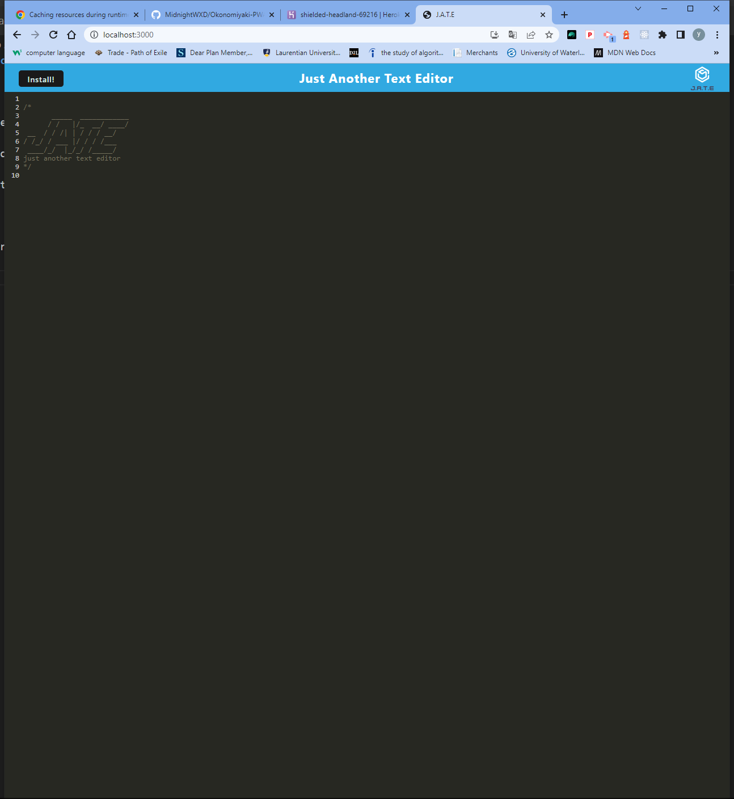
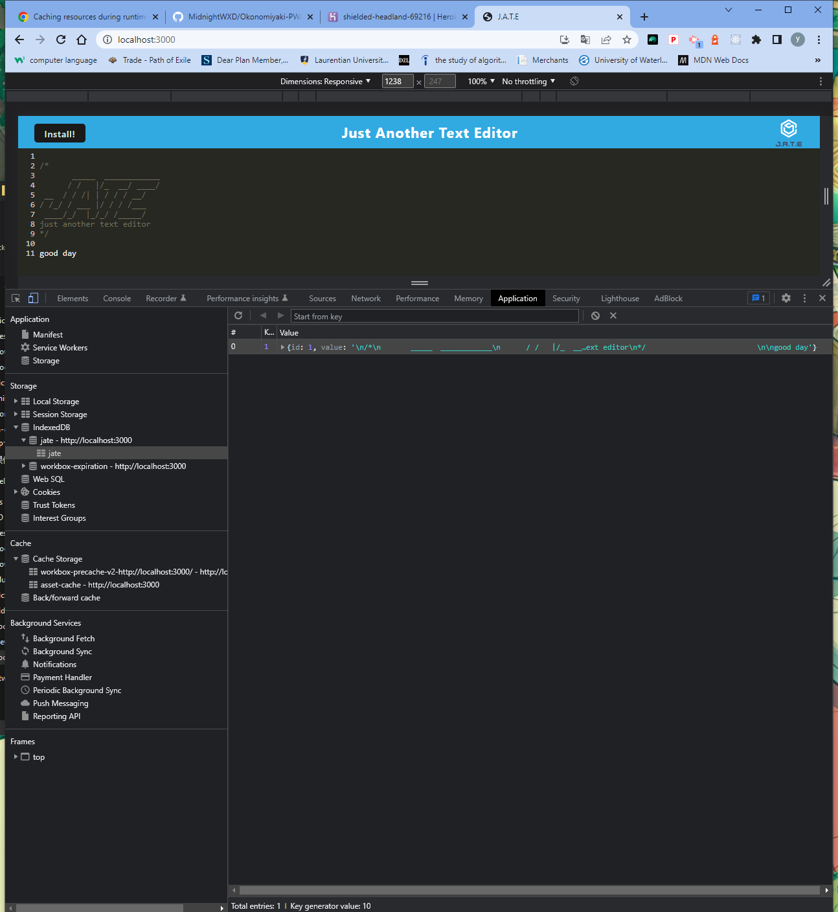

# 19 Progressive Web Applications (PWA): Text Editor

## Description

Text Editor which uses IndexedDB to create an object store and includes both GET and PUT methods.

The application works without an internet connection

Automatically saves content inside the text editor when the DOM window is unfocused

Bundled with webpack

Can be installed as a Progressive Web Application

## heroku link

https://shielded-headland-69216.herokuapp.com/